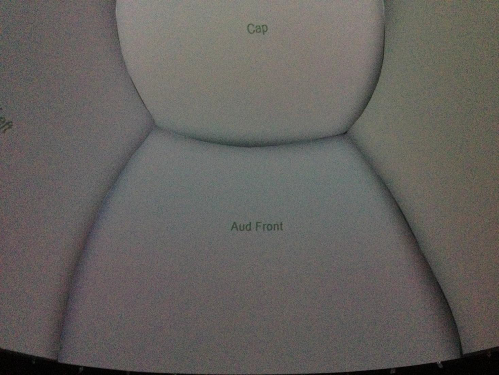
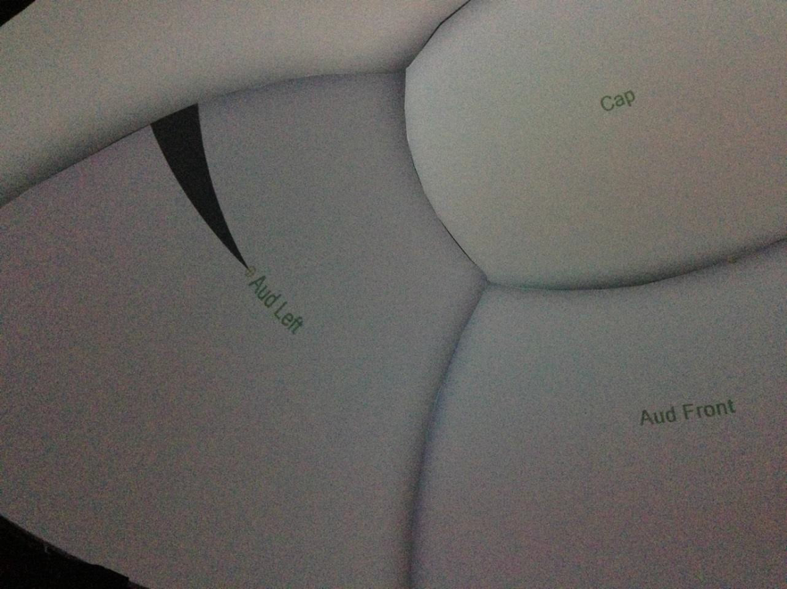
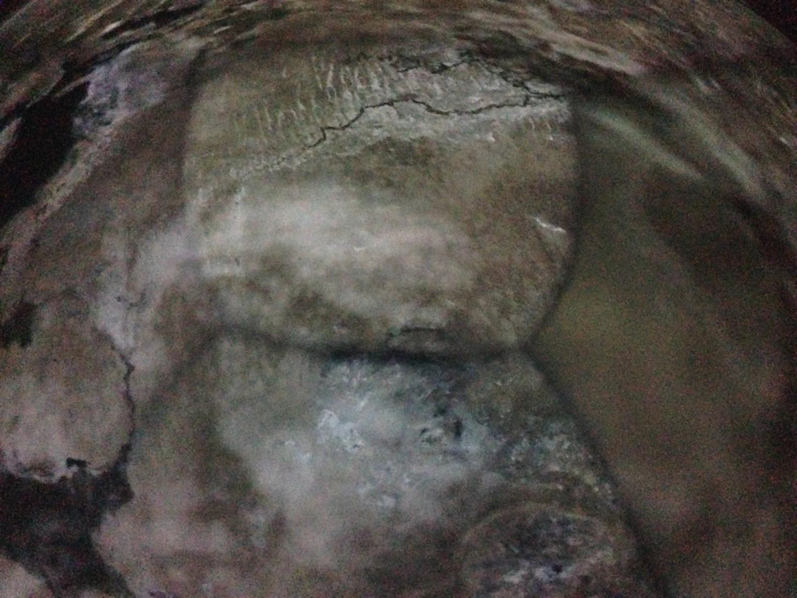

+++
title = "Blending"
weight = 800
+++

1. Setup blending
  1. Open Multi-Channel Setup Screen
  2. Click on the Blend Tab
  3. Click Transfer from edges – this will import the edge points you created before
  4. Turn on Calibration Screens
  5. You will see a screen similar to this representing blend regions and
     overlap based on your edge points. This is just the starting point for
     blending. The goal is to get the blends regions with no black, and as
     small of an overlap as possible 
  6. Go through each edge blend point and narrow or widen the overlap.
  7. Add points as needed. Example below
  8. Pull your bottom edge down to spring line
  9. Add a center point to assist
  10. After you have completed all blend edge regions, save your blend map 
  11. Click Make New Maps and then Send Maps to send updated blend maps to each node
  12. View your progress with a planet or sun to see blend regions clearly
  13. This process takes time and many passes to get perfect
  14. Use Blur size, iterations, and Gamma to fine tune blend region

_Example of a nearly blended system_

