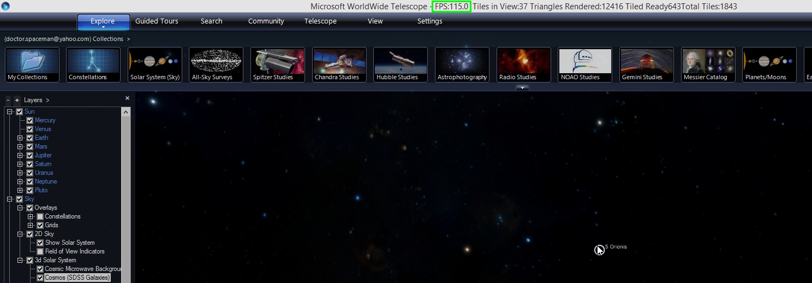
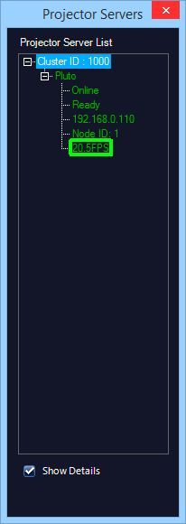
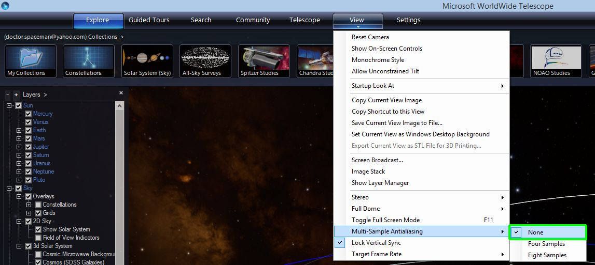

+++
title = "Tweaking Performance"
weight = 200
sort_by = "weight"
insert_anchor_links = "right"
+++

AAS WorldWide Telescope can show many layers and types of data, but various
things can affect visual performance, both interactivity and during playback.
A rule of thumb is that a modern PC with a dedicated graphics card will likely
perform fine for most installations. But older machines or modern ones that
have integrated graphics might not be adequate for the most accurate
rendering.

# Evaluating Performance

The most immediate way to evaluate performance is to show the frame rate. This
can be done by selecting: {{ui(p="Settings > Advanced > Show Performance
Data")}}.

When this is selected, WWT displays the frames per second (FPS) along with
other information about loaded data in the title bar of the main WWT window.

For cluster and dome installations, WWT can also report this frame rate for
all projector servers in a GUI on the master. To show this GUI, select
{{ui(p="Settings > Advanced > Projector Server List")}}. This GUI shows the
status of each projector server. This example has a single projection server
(Pluto) and shows whether the computer is on the network (Online), if WWT is
running (Ready), the IP for the projection server (192.168.0.110) and the
frame rate for that projector (20.5 FPS).

The frame rate could be capped by the WWT itself – see below – otherwise WWT
tries to draw as a new frame as fast as it can and the effective frame rate is
shown in the window. Frame rates of less than 30 will introduce noticeable
stuttering and numbers of less than 15 FPS will be very distracting. Note that
for simple scenes and fast hardware the FPS could be a large number – hundreds
– much larger in fact than the ability of a projector or monitor to display
it.

# Optimizing Performance

All visualization programs trade off visual fidelity with rendering time. When
you are using WWT to run a live program usually you want to trade off fidelity
with rendering time. In fast moving scenes where it may be hard to keep up
visually without having very low frame rates, the human perception of fidelity
is limited. So usually, you want to do what you can to keep FPS to 30 or above
and compromise on rendering quality if necessary.

For interactive and playback uses, you can change the following settings to
try to improve the performance.

## Anti-aliasing

Antialiasing is a graphics technique to redraw lines and edges with to avoid
showing them as jagged lines made up of individual pixels. Modern graphics
cards can usually handle this easily. However, most integrated graphics can’t
do this and thus those calculations are done by the CPU not the GPU, resulting
in very poor performance. The first step in improving performance is turning
off anti-aliasing. Open the menu {{ui(p="View > Multi-Sample Antialiasing")}}
and select **None**. Note, changing this value will require a restart of WWT
to take effect. When you have restarted play the tour again and look at the
FPS and see if that has improved the frame rate adequately.

## Content

The frame rate depends on the scene as well as the performance of the graphics
hardware. Within the constraints of the graphics hardware the only other thing
you can change is the content. The most difficult content to render is 3D
content: terrains of planetary surfaces, 3D models, or 3D cities. Content
affects performance in two stages. The first stage is data loading. Running
the tour through will load the data onto your local disk cache. This is the
first step, but final performance depends on how quickly you can get the data
into the computer’s GPU. When you play a tour if the data is being drawn as
you move through a scene then you want to make sure that data loading is done
before the audience sees it. The easiest way to do this is add the have the
first 1-2 seconds of the scene rendered while the display is faded to black.
Then fade up from black and most of the data will have been loaded for the
scene.

1. In the lower part of the layer manager, right-click on **Dome/Overlays/Fade
   to black** and select **Add to Timeline**. Unless the Tour will only be
   shown in a dome environment, make sure the **Fade Dome Only** under **Fade
   to black** is _not_ checked.
2. In the Timeline editor make a key for **FadeToBlack** at start time 00:00
   and set the Opacity, which is the only sub-property, to 1, which means it
   is faded to black. If the timeline editor is not shown, you can expose it
   be selecting **Show Timeline Editor** under the **Guided Tours** tab.
3. Then move the time slider to 2 seconds into the slide and make another
   **FadeToBlack** key and set it to 1 as well.
4. Make a third **FadeToBlack** key 1 second following the second key (at 3
   seconds) and set that value to 0\.
5. Play the slide and it should be black for the first 2 seconds, and
   hopefully that is enough time to load the necessary data. Then between 2
   and 3 seconds the scene should fade in from black.
6. Adjust the time locations of the keys to keep it black for long enough to
   hide the data loading if the suggested times are not sufficient.

## Target Frame Rate

WWT attempts to render frames as fast as the GPU can make them. This results
in the GPU being pushed hard and will cause it to consume more power and heat
up. If the GPU overheats, it can scale back its performance or shut down
completely. In real-world environments, the projectors and monitors only
operate at a certain refresh rate and rendering more frames per second isn’t
necessary. You can set the limit on the frame rate in the menu View/Target
Frame Rate. In most cases you want to choose 60 or 30 FPS.

## Rendering to Video

Interactive performance requires WWT to render the scene every frame, every
1/30 of a second. For playback that doesn’t require interactivity – for
instance in a planetarium system – one way to deal with performance issues it
to render the tour to a video for playback. That way, WWT can take as much
time as it needs to render a frame including fetching the data, putting the
scene together and finally rendering. To do this, load the desired tour. Then
under the open the **Render Tour to Video** dialog box under {{ui(p="Guided
Tours > Render to Video")}}. Then make sure the “Wait for all downloads” is
checked before rendering. More details on rendering to video are available
[in the Tour Authoring Guide][tour-video-rendering].

[tour-video-rendering]: https://docs.worldwidetelescope.org/tour-authoring-guide/1/render-video/
