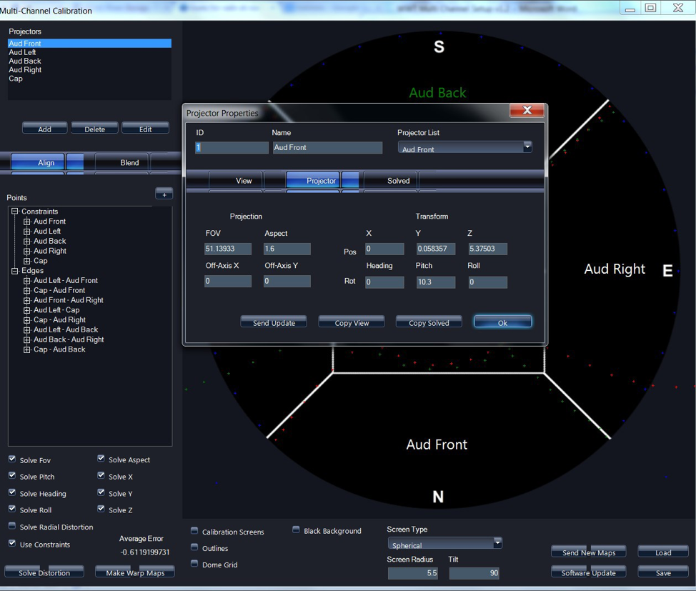
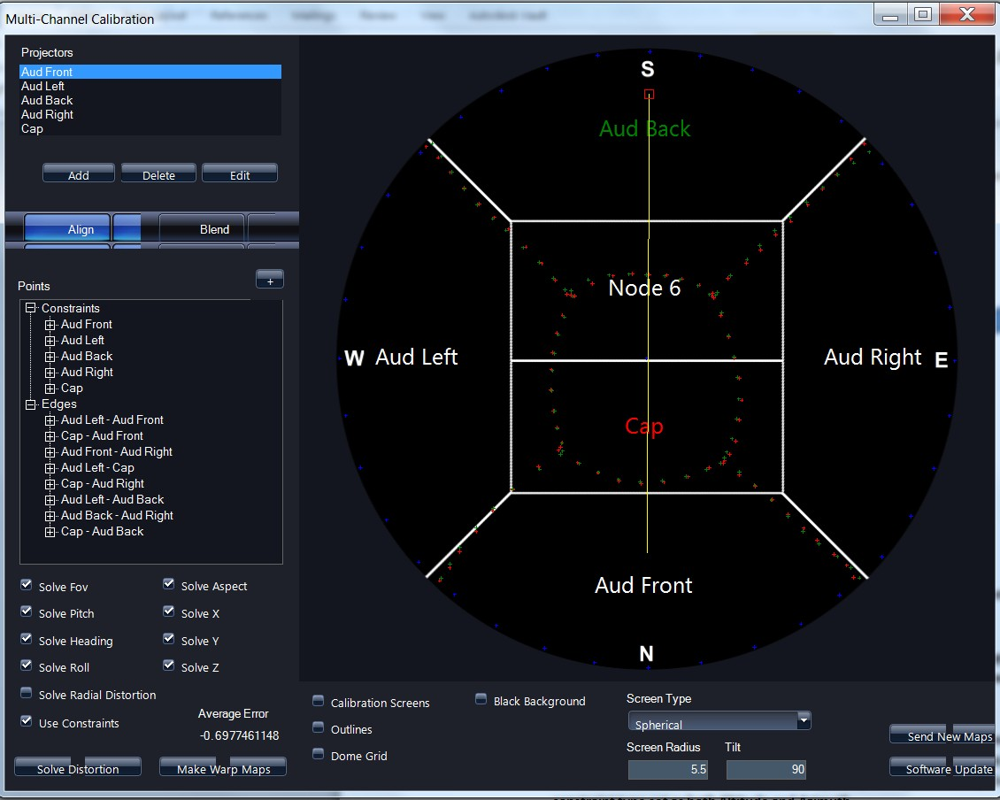
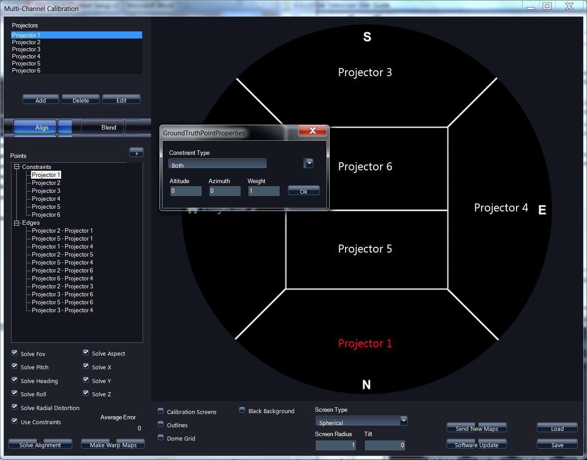

+++
title = "Projector Values"
weight = 300
+++

_Specifying projector values._


1. Enter Projector Values for each projector. This is where the projector is
   physically located in the dome.
  - Enter FOV and Aspect Values
  - Values for ```Pos- X,Y,Z``` are in meters
2. When you are finished entering in values for each projector, verify the
   orientation in the simulation pane for each projector and that it is
   correct
  - The red box indicates relative projector location
  - The yellow line represents the projection cone

_In this example, my Audience front projection area is being projected from
the rear of the dome, onto the front of the dome._


1. Set constraints (Spring-line, Zenith) by left clicking on the projection
   channel under points, and then right clicking to bring up properties.
  - Physical constraints on the dome that anchor the alignment (Zenith, spring
    line)
  - These points need to be placed as close as possible to each 10 degree
    physical mark on the dome.
  - While you are physically inside the dome, add a point and use left click
    to drag the point or “x” onto the corresponding 10 degree point in your
    dome.
  - Enter actual values for Altitude and Azimuth
    - Most constraints will only have altitude selected from the drop down
      constraint type with a value of 0 for 180 degree domes. For domes with a
      160 degree radius you must enter the value for altitude as 10\. North
      (AZ=0), South (AZ=180), East (AZ=90), and West (AZ=270) that will have a
      constraint type set as both Altitude and Azimuth.
    - The Cap Center Point or Zenith will have a constraint type set as Both
      in the dropdown menu with values of Alt=90, AZ=0, Weight of 10.
  - Weight refers to that points gravity, most points should be left at a
    value of 5, but absolute or North, South, East, West points can have a
    weight of up to 10
    
_Setting constraints_

