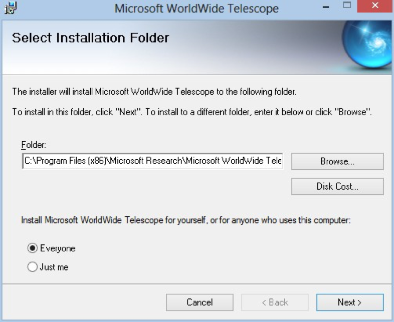
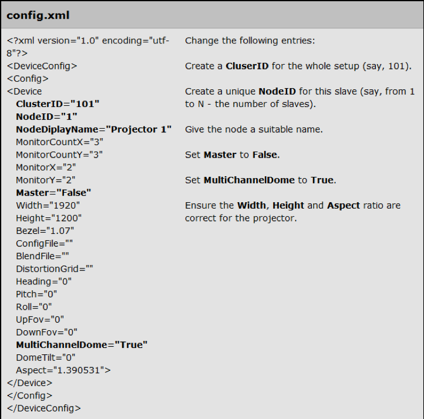
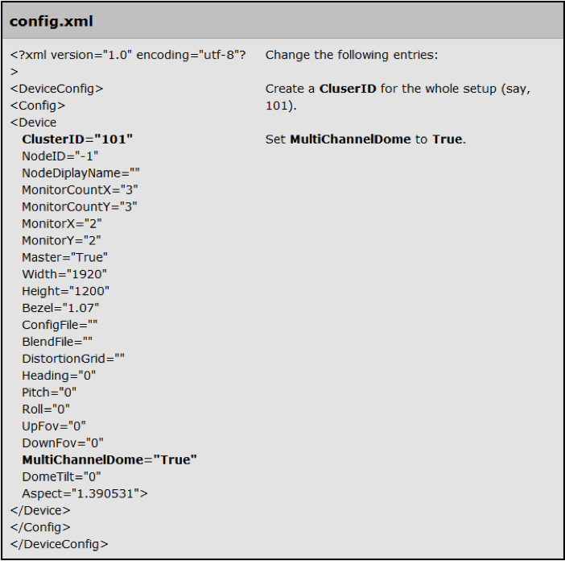
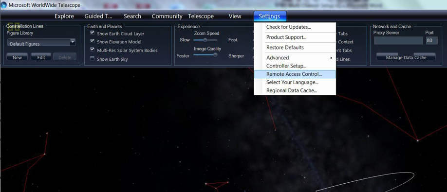
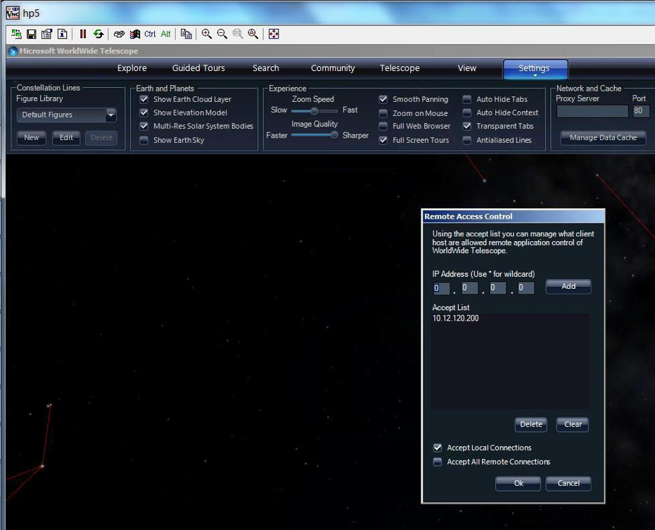
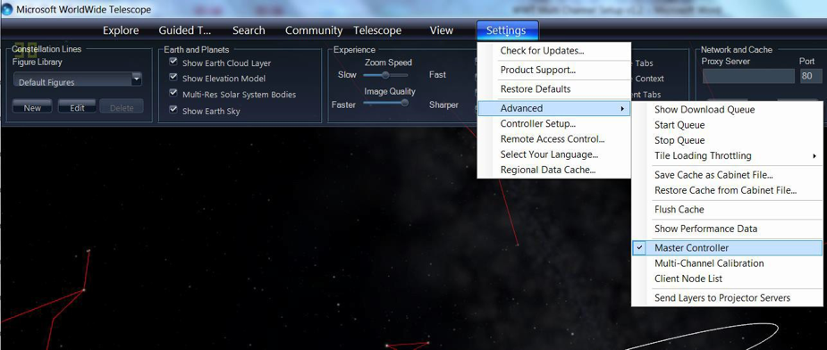
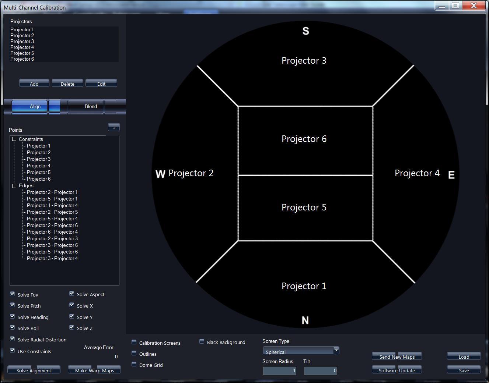
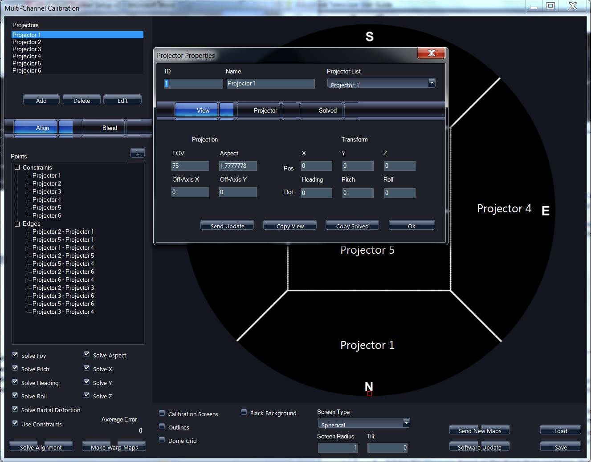

# Software Installation

1. Install WWT Windows Client on all Servers both Master and Projector servers, [http://www.worldwidetelescope.org](http://www.worldwidetelescope.org/)

  
  - Install with default folder path ```C:\Program Files (x86)\Microsoft Research\Microsoft WorldWide Telescope```

  -  The GUI or Master control channel needs to be a separate server from the projection channels

1.  Install Remote Control for Cluster Operation
    -  Remote can:
        -  Wake and shutdown projector server
        -  Shutdown WWT on projector server
        -  Startup WWT on projector server
    -  Record IP and MAC address for each node
    -  Turn off screen saver and energy saver settings for each node
    -  Both WWT and WWTRemote Control should be running on each slave/node for the projection to work correctly
1.  Install Excel Add-In for WWT
1.  Run WWT on each server independently before attempting to setup cluster.
    -  Run a tour or navigate around to load data into the cache
    -  WWT needs the cache folder populated to run smoothly
1.  Populate cluster configuration files
    -  Create a wwtconfig folder in the root directory of _each_ server including Master controller (```C:\wwtconfig```)
    -  Start WWT on each node – master and projection servers
    -  After WWT has fully started, exit program. This will cause a ```config.xml``` file to be created in the folder ```C:\wwtconfig```
    -  Using a text or XML editor, change the ```config.xml``` file as follows for _each_ of the projector nodes <br>
      _Example config.xml for projector nodes._
      

      1.  Create a unique cluster ID
      2.  Create a node ID
      3.  Change node Display name (such as dome orientation – where it is aimed)
      4.  Set Master to False
      5.  Enter actual resolution for your display in Width, and Height
      6.  Set MultiChannelDome to True
      7.  Save file and close editor
    -  Using a text or XML editor, change the config.xml file as follows for the Master node <br>
      _Example config.xml for Master node._
      
      1.  Enter your unique cluster id
      2.  Change Node Id to -1
      3.  Check and ensure Master is set to True
      4.  Enter actual resolution for your display in Width, and Height
      5.  Set MultiChannelDome to True
      6.  Save file and close editor

1.  Open Remote Access Control under Settings>Remote Access Control on _each_ node <br>
  _Select Remote Access Control._
  
  - Enter the IP address of your Master Controller Node. This ensures only you will have control of your nodes at all times.
  - Check Accept Local Connections. <br>
  _Setting IP address for Remote Access Control._
  

1.  Launch WWT on Master Controller node
2.  On Master Controller Node Ensure under ```Settings>Advanced``` that Master Controller is checked <br>
_Setting a node as Master Controller._


1.  Open Projector Server List under ```Settings> Advanced``` to ensure you can see all nodes, and they are green. This pane will also tell you frame rates and other useful information for each node. <br>
_Opening Projector Server List._


1.  Open ```Settings>Advanced>Multi Channel Calibration```<br>
_Selecting Multi-channel calibration._


1.  Set specifics for the projection area
    -  Select the type of screen as Spherical
    -  Set Screen Radius in meters
    -  Set Tilt to locate center of interest in the display. (example: A value of 60 indicates that main focus of most viewers will be on a point 60 degrees up from the spring-line)
    

1.  Set number of projectors in the top left panel
    -  Left click to highlight a channel
    -  The layout example is fixed and will not change from a six channel example
    -  Five channels is considered the minimum for a dome setup
    -  As you update your Projector names the text on the dome map will update
1.  Change properties for each channel by left clicking the channel you wish to edit and click the edit button
    -  Set each channel with the unique id, and name that was set earlier in the XML file
    -  View tab contains the idealized settings for the projector if it was centered exactly in the middle of the dome
    -  Projector tab pertains to the actual physical location of the projector
    -  Solved tab contains the temporary output from a Solve Alignment calculation
    
